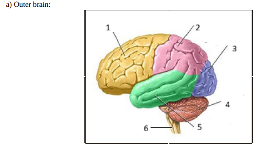
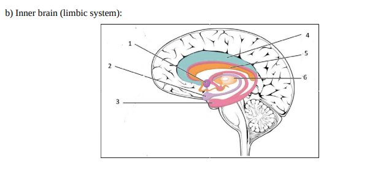
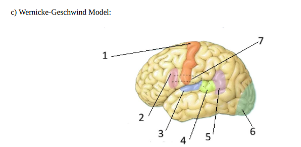

# ĐÁP ÁN CHI TIẾT - NHẬN THỨC, NGÔN NGỮ VÀ TƯ DUY

## A/ GIẢI PHẪU THẦN KINH

### a) Não ngoài (Outer Brain):

- **Vỏ não trước trán (Prefrontal Cortex)**: Lập kế hoạch, ra quyết định, kiểm soát hành vi
- **Vỏ não vận động (Motor Cortex)**: Điều khiển chuyển động tự nguyện
- **Vỏ não cảm giác (Somatosensory Cortex)**: Xử lý thông tin xúc giác, nhiệt độ, đau
- **Thùy thái dương (Temporal Lobe)**: Xử lý âm thanh, ngôn ngữ, trí nhớ
- **Thùy đỉnh (Parietal Lobe)**: Xử lý thông tin không gian, tích hợp cảm giác
- **Thùy chẩm (Occipital Lobe)**: Xử lý thông tin thị giác
- **Vỏ não Broca**: Sản xuất ngôn ngữ
- **Vỏ não Wernicke**: Hiểu ngôn ngữ

### b) Não bên trong - Hệ thống Limbic:

- **Hippocampus**: Hình thành trí nhớ mới, học tập
- **Amygdala**: Xử lý cảm xúc, đặc biệt là sợ hãi
- **Thalamus**: Trạm chuyển tiếp thông tin cảm giác
- **Hypothalamus**: Điều hòa nội tiết, cảm giác đói/khát
- **Thể chai (Corpus Callosum)**: Kết nối hai bán cầu não

### c) Mô hình Wernicke-Geschwind:

- **Vùng Broca**: Sản xuất lời nói
- **Vùng Wernicke**: Hiểu ngôn ngữ
- **Fasciculus arcuate**: Kết nối Broca và Wernicke
- **Vỏ não vận động**: Thực hiện lời nói
- **Vỏ não thính giác**: Nhận thông tin âm thanh

---

## B/ CÂU HỎI VỀ KIẾN THỨC MÔN HỌC

### **Câu 1: Nêu tên 5 nhà khoa học có đóng góp lớn trong lịch sử khoa học nhận thức và thành tựu của họ**

**Trả lời:**

1. **Wilhelm Wundt (1832-1920)**: Người sáng lập phòng thí nghiệm tâm lý học đầu tiên (1879), phát triển phương pháp nội tâm
2. **William James (1842-1910)**: Viết "Principles of Psychology" (1890), phát triển chủ nghĩa chức năng
3. **Jean Piaget (1896-1980)**: Lý thuyết phát triển nhận thức, các giai đoạn phát triển trí tuệ ở trẻ em
4. **Noam Chomsky (1928-)**: Ngữ pháp sinh thành, lý thuyết về năng lực ngôn ngữ bẩm sinh
5. **Alan Turing (1912-1954)**: Máy tính Turing, nền tảng cho trí tuệ nhân tạo và khoa học nhận thức

---

### **Câu 2: Nêu 5 ứng dụng trong AI/Robot dựa trên nhận thức hoặc ngôn ngữ**

**Trả lời:**

1. **Xử lý ngôn ngữ tự nhiên (NLP)**: Chatbot, trợ lý ảo (Siri, Alexa)
2. **Thị giác máy tính**: Nhận dạng khuôn mặt, xe tự lái
3. **Hệ thống gợi ý**: Netflix, Spotify dựa trên nhận thức sở thích người dùng
4. **Dịch máy**: Google Translate sử dụng học sâu
5. **Robot xã hội**: Robot chăm sóc người già, robot giáo dục có khả năng tương tác cảm xúc

---

### **Câu 3: Kể tên 5 rối loạn hoặc bệnh liên quan đến chức năng nhận thức hoặc ngôn ngữ**

**Trả lời:**

1. **Alzheimer**: Suy giảm trí nhớ, chức năng nhận thức
2. **Aphasia (Mất ngôn ngữ)**: Mất khả năng sản xuất hoặc hiểu ngôn ngữ
3. **Dyslexia (Khó đọc)**: Khó khăn trong việc đọc và xử lý ngôn ngữ viết
4. **ADHD**: Rối loạn chú ý và tăng động
5. **Schizophrenia**: Rối loạn tư duy, tri giác và ngôn ngữ

---

### **Câu 4: Phân biệt: não bộ – tâm trí – linh hồn – thể xác – tinh thần – ý thức**

**Trả lời:**

- **Não bộ (Brain)**: Cơ quan vật chất, mạng lưới tế bào thần kinh
- **Tâm trí (Mind)**: Tổng thể các quá trình nhận thức, tư duy, cảm xúc
- **Linh hồn (Soul)**: Khái niệm siêu hình, bản chất phi vật chất của con người
- **Thể xác (Body)**: Cơ thể vật lý
- **Tinh thần (Spirit)**: Trạng thái tâm lý, năng lượng tinh thần
- **Ý thức (Consciousness)**: Nhận thức về bản thân và môi trường xung quanh

---

### **Câu 5: Nêu tên và giải thích các loại thuyết nhất nguyên và nhị nguyên về thân và linh**

**Trả lời:**

**Nhất nguyên (Monism):**

1. **Vật chất luận (Materialism)**: Chỉ có vật chất tồn tại, tâm trí là sản phẩm của não
2. **Duy tâm luận (Idealism)**: Chỉ có tâm trí/ý thức tồn tại thực sự
3. **Trung lập luận (Neutral Monism)**: Thân và tâm là hai khía cạnh của một thực thể

**Nhị nguyên (Dualism):**

1. **Nhị nguyên thực thể (Substance Dualism - Descartes)**: Thân và tâm là hai thực thể riêng biệt
2. **Nhị nguyên thuộc tính (Property Dualism)**: Một thực thể nhưng có hai loại thuộc tính khác nhau

---

### **Câu 6: Phân biệt: chủ nghĩa siêu nhân - tải tâm trí lên mạng - thuyết toàn tâm - vũ trụ tâm trí – siêu trí tuệ – trí tuệ phi nhân loại**

**Trả lời:**

- **Chủ nghĩa siêu nhân (Transhumanism)**: Sử dụng công nghệ để nâng cao khả năng con người
- **Tải tâm trí lên mạng (Mind Uploading)**: Chuyển ý thức lên máy tính
- **Thuyết toàn tâm (Panpsychism)**: Mọi vật đều có ý thức ở mức độ nào đó
- **Vũ trụ tâm trí (Cosmic Mind)**: Ý thức vũ trụ kết nối mọi thứ
- **Siêu trí tuệ (Super Intelligence)**: Trí tuệ vượt xa con người
- **Trí tuệ phi nhân loại (Non-human Intelligence)**: Trí tuệ của động vật, AI, sinh vật ngoài hành tinh

---

### **Câu 7: Phân biệt: nhận thức – cảm giác – tri giác – tư duy – lý luận – ra quyết định – giải quyết vấn đề**

**Trả lời:**

- **Nhận thức (Cognition)**: Toàn bộ quá trình xử lý thông tin
- **Cảm giác (Sensation)**: Nhận thông tin qua các giác quan
- **Tri giác (Perception)**: Giải thích và tổ chức thông tin cảm giác
- **Tư duy (Thought)**: Quá trình xử lý thông tin trong tâm trí
- **Lý luận (Reasoning)**: Sử dụng logic để đi đến kết luận
- **Ra quyết định (Decision Making)**: Lựa chọn giữa các phương án
- **Giải quyết vấn đề (Problem Solving)**: Tìm giải pháp cho tình huống khó khăn

---

### **Câu 8: Các nguyên tắc Gestalt về nhận thức là gì?**

**Trả lời:**

1. **Proximity (Gần gũi)**: Các vật gần nhau được nhóm lại
2. **Similarity (Tương đồng)**: Các vật giống nhau được nhóm lại
3. **Closure (Khép kín)**: Bộ não hoàn thiện hình ảnh chưa hoàn chỉnh
4. **Continuity (Liên tục)**: Ưu tiên nhìn theo đường liên tục
5. **Figure-Ground (Hình-nền)**: Phân biệt đối tượng và nền
6. **Common Fate (Số phận chung)**: Vật chuyển động cùng hướng được nhóm lại

---

### **Câu 9: Các loại chú ý chính là gì? Phân biệt 3 lý thuyết về chú ý**

**Trả lời:**

**Các loại chú ý:**

- Chú ý có chọn lọc (Selective)
- Chú ý phân chia (Divided)
- Chú ý duy trì (Sustained)
- Chú ý chuyển đổi (Alternating)

**Ba lý thuyết:**

1. **Lý thuyết lọc của Broadbent**: Lọc thông tin ở giai đoạn sớm dựa trên đặc điểm vật lý
2. **Mô hình suy giảm của Treisman**: Suy giảm thông tin không được chú ý, không loại bỏ hoàn toàn
3. **Lý thuyết chọn lọc muộn**: Tất cả thông tin được xử lý, chọn lọc xảy ra ở giai đoạn muộn

---

### **Câu 10: Giải thích mô hình ba hộp về trí nhớ (Atkinson & Shiffrin, 1968)**

**Trả lời:**

1. **Trí nhớ cảm giác (Sensory Memory)**: Lưu trữ ngắn hạn thông tin cảm giác (0.5-3 giây)
2. **Trí nhớ ngắn hạn (Short-term Memory/Working Memory)**: Lưu trữ tạm thời (15-30 giây), dung lượng 7±2 mục
3. **Trí nhớ dài hạn (Long-term Memory)**: Lưu trữ lâu dài, dung lượng không giới hạn

Thông tin di chuyển từ trí nhớ cảm giác → trí nhớ ngắn hạn (qua chú ý) → trí nhớ dài hạn (qua lặp lại và mã hóa)

---

### **Câu 11: Ra quyết định - Lý thuyết tiện ích kỳ vọng**

**Trả lời:**

**Công thức: EU = Σ(Xác suất × Giá trị)**

**Lựa chọn 1: Cao học**

- Thành công (60%): Giá trị = 80
- Thất bại (40%): Giá trị = 30
- EU₁ = (0.6 × 80) + (0.4 × 30) = 48 + 12 = **60**

**Lựa chọn 2: Trường dạy nấu ăn**

- Thành công (40%): Giá trị = 90
- Thất bại (60%): Giá trị = 20
- EU₂ = (0.4 × 90) + (0.6 × 20) = 36 + 12 = **48**

**Kết luận:** Nên chọn cao học (EU = 60 > 48)

---

### **Câu 12: Nêu và giải thích 5 loại thiên kiến nhận thức ảnh hưởng đến lý luận**

**Trả lời:**

1. **Confirmation Bias**: Xu hướng tìm kiếm thông tin xác nhận niềm tin sẵn có
2. **Anchoring Bias**: Dựa quá nhiều vào thông tin đầu tiên
3. **Availability Heuristic**: Đánh giá dựa trên thông tin dễ nhớ nhất
4. **Hindsight Bias**: Nghĩ rằng mình đã biết trước kết quả
5. **Dunning-Kruger Effect**: Người thiếu năng lực đánh giá quá cao bản thân

---

### **Câu 13: Phân biệt cảm xúc – cảm giác – tâm trạng. Ba yếu tố chính của cảm xúc? Ba loại đồng cảm?**

**Trả lời:**

**Phân biệt:**

- **Cảm xúc (Emotion)**: Phản ứng ngắn hạn, mạnh mẽ với sự kiện cụ thể
- **Cảm giác (Feeling)**: Trải nghiệm chủ quan của cảm xúc
- **Tâm trạng (Mood)**: Trạng thái cảm xúc kéo dài, không rõ nguyên nhân

**Ba yếu tố của cảm xúc:**

1. Thành phần sinh lý (Physiological)
2. Thành phần nhận thức (Cognitive)
3. Thành phần hành vi (Behavioral)

**Ba loại đồng cảm:**

1. **Đồng cảm nhận thức (Cognitive)**: Hiểu cảm xúc người khác
2. **Đồng cảm cảm xúc (Emotional)**: Cảm nhận cảm xúc người khác
3. **Đồng cảm thương cảm (Compassionate)**: Muốn giúp đỡ người khác

---

### **Câu 14: Phân biệt động lực nội tại và bên ngoài. Theo Maslow, con người cần gì để đạt hạnh phúc?**

**Trả lời:**

**Động lực:**

- **Nội tại (Intrinsic)**: Xuất phát từ bên trong (thích thú, đam mê)
- **Bên ngoài (Extrinsic)**: Xuất phát từ phần thưởng/hình phạt bên ngoài

**Tháp nhu cầu Maslow (từ dưới lên):**

1. **Nhu cầu sinh lý** (bên ngoài): Ăn, uống, ngủ
2. **Nhu cầu an toàn** (bên ngoài): An ninh, sức khỏe
3. **Nhu cầu xã hội** (bên ngoài): Tình yêu, thuộc về
4. **Nhu cầu tôn trọng** (nội tại): Thành tích, danh tiếng
5. **Nhu cầu tự hoàn thiện** (nội tại): Phát triển tiềm năng

Để đạt hạnh phúc cần đáp ứng đầy đủ các nhu cầu, đặc biệt là tự hoàn thiện.

---

### **Câu 15: Phân biệt các khái niệm về căng thẳng. Ai dễ bị ảnh hưởng nhất?**

**Trả lời:**

- **Căng thẳng cấp tính (Acute Stress)**: Ngắn hạn, phản ứng tức thì
- **Căng thẳng mãn tính (Chronic Stress)**: Kéo dài, liên tục
- **Căng thẳng từng đợt (Episodic Stress)**: Căng thẳng cấp tính lặp lại thường xuyên
- **Đau khổ (Distress)**: Căng thẳng tiêu cực
- **Căng thẳng tích cực (Eustress)**: Căng thẳng tích cực, kích thích
- **Kiệt sức (Burnout)**: Kiệt quệ về thể chất, tinh thần do căng thẳng kéo dài
- **Sức khỏe tâm thần (Mental Health)**: Trạng thái khỏe mạnh
- **Bệnh tâm thần (Mental Illness)**: Rối loạn tâm lý được chẩn đoán

**Người dễ bị ảnh hưởng:** Sinh viên, nhân viên y tế, người làm việc áp lực cao

**Cách giảm căng thẳng:** Tập thể dục, thiền, giao lưu xã hội, sở thích cá nhân

---

### **Câu 16: Theo Gardner, các loại trí thông minh chính là gì?**

**Trả lời:**

1. **Ngôn ngữ (Linguistic)**: Sử dụng ngôn ngữ hiệu quả
2. **Logic-Toán học (Logical-Mathematical)**: Lý luận, giải quyết vấn đề
3. **Không gian (Spatial)**: Hình dung không gian 3D
4. **Âm nhạc (Musical)**: Nhạc điệu, nhịp điệu
5. **Vận động thể chất (Bodily-Kinesthetic)**: Điều khiển cơ thể
6. **Giao tiếp xã hội (Interpersonal)**: Hiểu người khác
7. **Nội tâm (Intrapersonal)**: Hiểu bản thân
8. **Tự nhiên (Naturalistic)**: Nhận biết tự nhiên

---

### **Câu 17: Theo Graham Wallas, 4 giai đoạn sáng tạo là gì?**

**Trả lời:**

1. **Chuẩn bị (Preparation)**: Thu thập thông tin, nghiên cứu vấn đề
2. **Ủ ý (Incubation)**: Vô thức xử lý thông tin
3. **Sáng suốt (Illumination)**: Ý tưởng xuất hiện đột ngột ("Aha moment")
4. **Xác minh (Verification)**: Kiểm tra và hoàn thiện ý tưởng

**Ví dụ cá nhân:** [Sinh viên tự trả lời về ý tưởng sáng tạo của mình]

---

### **Câu 18: Ngôn ngữ là gì? Ngôn ngữ học là gì? Các nhánh chính?**

**Trả lời:**

**Ngôn ngữ (Language):** Hệ thống ký hiệu và quy tắc để giao tiếp

**Ngôn ngữ học (Linguistics):** Nghiên cứu khoa học về ngôn ngữ

**Các nhánh chính:**

1. **Phonetics (Ngữ âm học)**: Âm thanh lời nói
2. **Phonology (Âm vị học)**: Hệ thống âm thanh
3. **Morphology (Hình thái học)**: Cấu trúc từ
4. **Syntax (Cú pháp)**: Cấu trúc câu
5. **Semantics (Ngữ nghĩa)**: Ý nghĩa
6. **Pragmatics (Ngữ dụng)**: Sử dụng ngôn ngữ trong ngữ cảnh

---

### **Câu 19: Phân biệt 5 thành phần cơ bản của ngôn ngữ học và đơn vị nhỏ nhất**

**Trả lời:**

1. **Phonetics/Phonology**: Đơn vị nhỏ nhất là **phoneme** (âm vị)
2. **Morphology**: Đơn vị nhỏ nhất là **morpheme** (hình vị)
3. **Syntax**: Đơn vị nhỏ nhất là **word** (từ)
4. **Semantics**: Đơn vị nhỏ nhất là **seme** (nghĩa tố)
5. **Pragmatics**: Đơn vị nhỏ nhất là **speech act** (hành động ngôn ngữ)

---

### **Câu 20: Lý thuyết hành động ngôn ngữ - Austin và Searle**

**Trả lời:**

**Austin (1962) - 3 loại:**

1. **Locutionary**: Hành động nói (phát âm, cú pháp, nghĩa)
2. **Illocutionary**: Mục đích (hứa, hỏi, ra lệnh)
3. **Perlocutionary**: Kết quả tác động

**Searle (1976) - 5 loại:**

1. **Assertives**: Khẳng định ("Trời mưa")
2. **Directives**: Chỉ đạo ("Hãy đóng cửa")
3. **Commissives**: Cam kết ("Tôi hứa")
4. **Expressives**: Cảm xúc ("Xin lỗi")
5. **Declarations**: Tuyên bố ("Tôi tuyên bố...")

---

### **Câu 21: Các nhánh chính của ngữ âm học là gì?**

**Trả lời:**

1. **Articulatory Phonetics (Ngữ âm phát âm)**: Cách tạo ra âm thanh
2. **Acoustic Phonetics (Ngữ âm âm học)**: Tính chất vật lý của âm thanh
3. **Auditory Phonetics (Ngữ âm thính giác)**: Cách tai và não nhận âm thanh

---

### **Câu 22: Các yếu tố ảnh hưởng đến sự tiến hóa của ngôn ngữ?**

**Trả lời:**

1. **Di cư và tiếp xúc văn hóa**: Ngôn ngữ lai
2. **Công nghệ**: Internet, mạng xã hội
3. **Chính trị**: Chính sách ngôn ngữ
4. **Xã hội**: Thay đổi cấu trúc xã hội
5. **Kinh tế**: Toàn cầu hóa
6. **Sinh học**: Sự thay đổi cơ quan phát âm

---

### **Câu 23: 4 nguyên tắc hội thoại của Grice (1975)?**

**Trả lời:**

1. **Maxim of Quantity (Số lượng)**: Cung cấp đủ thông tin, không thừa
2. **Maxim of Quality (Chất lượng)**: Nói sự thật, có bằng chứng
3. **Maxim of Relation (Liên quan)**: Nói điều phù hợp
4. **Maxim of Manner (Cách thức)**: Rõ ràng, ngắn gọn, có thứ tự

**Phân tích quảng cáo:** [Cần có hình ảnh quảng cáo cụ thể để phân tích vi phạm nguyên tắc nào]

---

### **Câu 24: Phân biệt học ngôn ngữ và tiếp thu ngôn ngữ? Giả thuyết giai đoạn quan trọng? Các giai đoạn phát triển của Piaget?**

**Trả lời:**

**Language Learning vs Acquisition:**

- **Learning**: Có ý thức, qua học tập chính thức
- **Acquisition**: Tự nhiên, vô thức, qua giao tiếp

**Critical Period Hypothesis:** Có giai đoạn nhạy cảm (0-7 tuổi) để học ngôn ngữ hiệu quả nhất

**Các giai đoạn của Piaget:**

1. **Cảm giác-Vận động (0-2 tuổi)**: Khám phá qua giác quan
2. **Tiền tác nghiệp (2-7 tuổi)**: Tư duy biểu tượng, chưa logic
3. **Tác nghiệp cụ thể (7-11 tuổi)**: Logic với vật cụ thể
4. **Tác nghiệp hình thức (11+ tuổi)**: Tư duy trừu tượng

---

### **Câu 25: Theo mô hình Levelt, các giai đoạn sản xuất ngôn ngữ?**

**Trả lời:**

1. **Conceptualization**: Hình thành ý định giao tiếp
2. **Formulation**:
   - Grammatical encoding: Chọn từ, cấu trúc ngữ pháp
   - Phonological encoding: Mã hóa âm thanh
3. **Articulation**: Thực hiện phát âm

**Ví dụ tạo từ "cat":**

- Ý tưởng: Muốn nói về con mèo
- Chọn từ: "cat" từ vựng tâm trí
- Mã hóa: /kæt/
- Phát âm: Di chuyển cơ miệng

---

### **Câu 26: Các đơn vị tư duy là gì?**

**Trả lời:**

1. **Concepts (Khái niệm)**: Biểu diễn tinh thần của đối tượng, ý tưởng
2. **Propositions (Mệnh đề)**: Khẳng định về mối quan hệ
3. **Images (Hình ảnh)**: Biểu diễn hình ảnh trong tâm trí
4. **Schemas (Lược đồ)**: Cấu trúc tri thức tổ chức
5. **Mental Models (Mô hình tinh thần)**: Biểu diễn hệ thống phức tạp

---

### **Câu 27: 6 cấp độ tư duy phản biện (Bloom) và 4 cấp độ chiều sâu (Webb)?**

**Trả lời:**

**Bloom's Taxonomy (1990):**

1. Remember (Nhớ)
2. Understand (Hiểu)
3. Apply (Áp dụng)
4. Analyze (Phân tích)
5. Evaluate (Đánh giá)
6. Create (Sáng tạo)

**Webb's Depth of Knowledge (2002):**

1. **Level 1**: Recall - Nhớ lại
2. **Level 2**: Skill/Concept - Kỹ năng/Khái niệm
3. **Level 3**: Strategic Thinking - Tư duy chiến lược
4. **Level 4**: Extended Thinking - Tư duy mở rộng

---

### **Câu 28: Nêu 5 loại tư duy và ví dụ**

**Trả lời:**

1. **Critical Thinking (Tư duy phản biện)**: Phân tích lập luận, đánh giá bằng chứng
   - Ví dụ: Đọc tin tức và kiểm tra nguồn trước khi tin
2. **Creative Thinking (Tư duy sáng tạo)**: Tạo ra ý tưởng mới
   - Ví dụ: Brainstorming các giải pháp độc đáo
3. **Analytical Thinking (Tư duy phân tích)**: Chia nhỏ vấn đề phức tạp
   - Ví dụ: Phân tích dữ liệu thống kê
4. **Convergent Thinking (Tư duy hội tụ)**: Tìm một câu trả lời đúng
   - Ví dụ: Giải phương trình toán học
5. **Divergent Thinking (Tư duy phân kỳ)**: Tạo nhiều giải pháp khác nhau
   - Ví dụ: Nghĩ ra 20 cách sử dụng cho một chiếc cốc

---

### **Câu 29: Phân biệt tư duy đối kháng và tư duy song song. Sáu chiếc mũ tư duy là gì?**

**Trả lời:**

**Tư duy đối kháng (Adversarial Thinking):**

- Mỗi bên bảo vệ quan điểm của mình
- Tranh luận, phản bác
- Tìm điểm yếu của đối phương

**Tư duy song song (Parallel Thinking):**

- Cùng nhìn vào một hướng
- Hợp tác, không tranh cãi
- Khám phá các khía cạnh khác nhau

**Sáu chiếc mũ tư duy (Edward de Bono):**

1. **Mũ Trắng**: Sự kiện, dữ liệu khách quan
2. **Mũ Đỏ**: Cảm xúc, trực giác
3. **Mũ Đen**: Thận trọng, rủi ro, tiêu cực
4. **Mũ Vàng**: Lạc quan, lợi ích, tích cực
5. **Mũ Xanh lá**: Sáng tạo, ý tưởng mới
6. **Mũ Xanh dương**: Quản lý, tổ chức tư duy

---

### **Câu 30: Kể tên 5 công cụ tư duy. Ví dụ**

**Trả lời:**

1. **Mind Mapping (Sơ đồ tư duy)**: Tổ chức ý tưởng dạng cây
   - Ví dụ: Lập kế hoạch dự án
2. **SWOT Analysis**: Phân tích Strengths, Weaknesses, Opportunities, Threats
   - Ví dụ: Phân tích chiến lược kinh doanh
3. **Fishbone Diagram (Ishikawa)**: Phân tích nguyên nhân-kết quả
   - Ví dụ: Tìm nguyên nhân lỗi sản xuất
4. **Decision Matrix**: Bảng so sánh các lựa chọn
   - Ví dụ: Chọn mua laptop dựa trên nhiều tiêu chí
5. **5 Whys**: Hỏi "Tại sao?" 5 lần để tìm nguyên nhân gốc rễ
   - Ví dụ: Tìm nguyên nhân thất bại dự án

---

### **Câu 31: Ẩn dụ khái niệm là gì? Tìm ví dụ trong ngôn ngữ thường ngày**

**Trả lời:**

**Ẩn dụ khái niệm (Conceptual Metaphor - Lakoff & Johnson):**
Hiểu một khái niệm trừu tượng thông qua một khái niệm cụ thể khác

**Ví dụ:**

1. **THỜI GIAN LÀ TIỀN BẠC**:

   - "Lãng phí thời gian"
   - "Tiết kiệm thời gian"
   - "Đầu tư thời gian"

2. **CUỘC SỐNG LÀ HÀNH TRÌNH**:

   - "Con đường phía trước"
   - "Gặp chướng ngại"
   - "Đến đích"

3. **TRANH LUẬN LÀ CHIẾN TRANH**:

   - "Tấn công lập luận"
   - "Bảo vệ quan điểm"
   - "Chiến thắng tranh luận"

4. **YÊU LÀ HÀNH TRÌNH**:
   - "Mối quan hệ đi vào ngõ cụt"
   - "Chúng ta đang đi đúng hướng"

---

### **Câu 32: Thuyết tư duy kép là gì? Sự khác biệt chức năng giữa hai bán cầu não? Tính dẻo dai thần kinh?**

**Trả lời:**

**Thuyết tư duy kép (Dual Process Theory):**

- **System 1**: Nhanh, tự động, trực giác, không cần nỗ lực
- **System 2**: Chậm, có ý thức, logic, cần nỗ lực

**Chức năng hai bán cầu não:**

**Bán cầu trái:**

- Ngôn ngữ
- Logic, phân tích
- Toán học
- Tư duy tuần tự

**Bán cầu phải:**

- Không gian, hình ảnh
- Sáng tạo, nghệ thuật
- Âm nhạc
- Nhận diện khuôn mặt

**Tính dẻo dai thần kinh (Neuroplasticity):**
Khả năng não bộ thay đổi cấu trúc và chức năng

**Hai loại:**

1. **Structural Plasticity (Cấu trúc)**: Thay đổi kết nối thần kinh vật lý
   - Ví dụ: Học kỹ năng mới tạo synapse mới
2. **Functional Plasticity (Chức năng)**: Chuyển chức năng sang vùng khác
   - Ví dụ: Sau chấn thương, vùng não khác đảm nhận chức năng

---

### **Câu 33: Phân biệt thuyết phổ quát ngôn ngữ – thuyết quyết định ngôn ngữ – thuyết tương đối ngôn ngữ. 5 ví dụ giả thuyết Sapir-Whorf**

**Trả lời:**

**Phân biệt:**

1. **Linguistic Universalism (Thuyết phổ quát ngôn ngữ)**:

   - Tất cả ngôn ngữ có cấu trúc chung
   - Ngôn ngữ không ảnh hưởng tư duy
   - Chomsky: Universal Grammar

2. **Linguistic Determinism (Thuyết quyết định ngôn ngữ)**:

   - Ngôn ngữ quyết định hoàn toàn tư duy
   - Không thể nghĩ về thứ không có từ
   - Phiên bản mạnh của Sapir-Whorf

3. **Linguistic Relativity (Thuyết tương đối ngôn ngữ)**:
   - Ngôn ngữ ảnh hưởng nhưng không quyết định tư duy
   - Phiên bản yếu của Sapir-Whorf

**5 ví dụ giả thuyết Sapir-Whorf:**

1. **Màu sắc**: Người Eskimo có nhiều từ cho "tuyết", nhận biết sắc thái tuyết tốt hơn

2. **Hướng không gian**: Người Guugu Yimithirr (Úc) dùng hướng tuyệt đối (đông-tây-nam-bắc) thay vì trái-phải, có khả năng định hướng tốt hơn

3. **Thời gian**: Tiếng Hopi không có thì quá khứ-tương lai rõ ràng, người Hopi có quan niệm thời gian khác

4. **Giới tính ngữ pháp**: Tiếng Đức "cây cầu" là giống cái (die Brücke), người Đức mô tả cây cầu với tính từ nữ tính hơn (đẹp, thanh lịch). Tiếng Tây Ban Nha "cây cầu" là giống đực (el puente), mô tả với tính từ nam tính hơn (mạnh mẽ, vững chắc)

5. **Số đếm**: Một số bộ lạc Amazon chỉ có từ "một", "hai", "nhiều", khó khăn trong tính toán chính xác số lượng lớn

---

## KẾT LUẬN

Đây là bộ câu hỏi ôn tập đầy đủ 33 câu cho môn Nhận thức, Ngôn ngữ và Tư duy. Chúc bạn ôn tập tốt và đạt điểm cao trong kỳ thi!

**Lưu ý:**

- Chuẩn bị thêm phần giải phẫu thần kinh với hình ảnh
- Chọn 1 bài báo từ LMS để chuẩn bị thuyết trình
- Ôn lại các slide và câu hỏi thảo luận

**Thời gian thi:** 06 & 07/01/2026, từ 8h sáng
**Địa điểm:** Phòng 307-A
**Hình thức:** Thi vấn đáp (10 điểm = 2đ Giải phẫu + 4đ Kiến thức + 4đ Bài báo)
